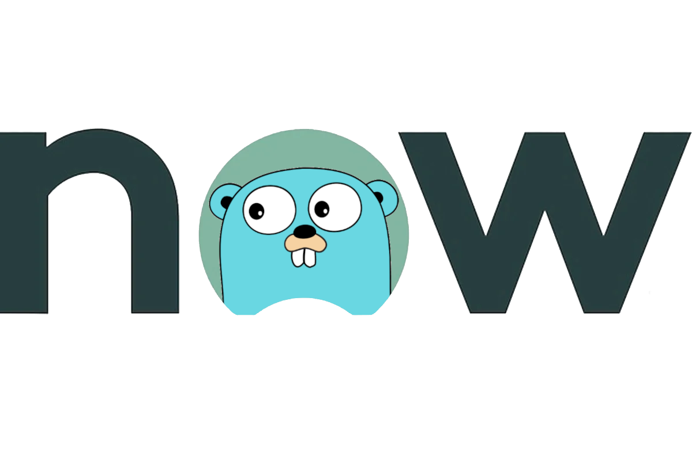

# ServiceNow SDK for Go


[](https://pkg.go.dev/github.com/RecoLabs/servicenow-sdk-go)


[](https://codeclimate.com/github/michaeldcanady/servicenow-sdk-go)
[](https://codecov.io/gh/michaeldcanady/servicenow-sdk-go)

A Service-Now API client enabling Go programs to interact with Service-Now in a simple and uniform way



## Supported Service-Now APIs

| API                                                                                        | Status | Issues                                                                                                                                                                                                        |
| ------------------------------------------------------------------------------------------ | ------ | ------------------------------------------------------------------------------------------------------------------------------------------------------------------------------------------------------------- |
| Account                                                                                    | ✖️      |                                                                                                                                                                                                               |
| ActivitySubscriptions                                                                      | ✖️      |                                                                                                                                                                                                               |
| Agent Client Collector                                                                     | ✖️      |                                                                                                                                                                                                               |
| Aggregate                                                                                  | ✖️      |                                                                                                                                                                                                               |
| AI Search External User Mapping                                                            | ✖️      |                                                                                                                                                                                                               |
| Alarm Management Open                                                                      | ✖️      |                                                                                                                                                                                                               |
| Application Service                                                                        | ✖️      |                                                                                                                                                                                                               |
| Appointment                                                                                | ✖️      |                                                                                                                                                                                                               |
| [Attachment](https://github.com/RecoLabs/servicenow-sdk-go/tree/main/attachment-api) | ♻️      | [](https://github.com/RecoLabs/servicenow-sdk-go/labels/attachment%20api) |
| Advanced Work Assignment (AWA) Agent                                                       | ✖️      |                                                                                                                                                                                                               |
| AWA Assignment                                                                             | ✖️      |                                                                                                                                                                                                               |
| AWA Routing                                                                                | ✖️      |                                                                                                                                                                                                               |
| [Batch](https://github.com/RecoLabs/servicenow-sdk-go/tree/main/batch-api)           | ♻️      | [](https://github.com/RecoLabs/servicenow-sdk-go/labels/batch%20api)                |
| Case                                                                                       | ✖️      |                                                                                                                                                                                                               |
| Custom Chat Chatbot Interoperability Framework (CCCIF) Media Resource                      | ✖️      |                                                                                                                                                                                                               |
| CdmApplicationsApi                                                                         | ✖️      |                                                                                                                                                                                                               |
| CdmChangesetsApi                                                                           | ✖️      |                                                                                                                                                                                                               |
| CdmEditorApi                                                                               | ✖️      |                                                                                                                                                                                                               |
| CdmPoliciesApi                                                                             | ✖️      |                                                                                                                                                                                                               |
| [Tables](https://github.com/RecoLabs/servicenow-sdk-go/tree/main/table-api)          | ✔️      | [](https://github.com/RecoLabs/servicenow-sdk-go/labels/table%20api)                |
---

| Emoji | Meaning       |
| ----- | ------------- |
| ✔️     | Supported     |
| 🆕     | Preview       |
| ♻️     | In progress   |
| ✖️     | Not supported |

## Prerequisites

Before you begin, ensure that you have the following:

1. **Golang v1.21 or higher**: If you haven't already installed Go, you can do so by following the instructions [here](https://go.dev/doc/install).

## 1. Installation

You can install the ServiceNow SDK using the following commands:

### Install the Latest Version

```Shell
go get github.com/RecoLabs/servicenow-sdk-go
```

### Install a Specific Version

If you need a specific version, use the following command, replacing `version` with the desired version:

```Shell
go get github.com/RecoLabs/servicenow-sdk-go@version
```

## 2. Getting Started

### 2.1 Create an AuthenticationProvider Object

To authenticate with ServiceNow, create a credential object. Here's an example using username and password:

```golang
import (
    "github.com/RecoLabs/servicenow-sdk-go/credentials"
)

cred := credentials.NewUsernamePasswordCredential("username", "password")
```

### 2.2 Initialize a ServiceNow Client

Create a client object to interact with ServiceNow APIs:

```golang
import (
    servicenowsdkgo "github.com/RecoLabs/servicenow-sdk-go"
)

client, err := servicenowsdkgo.NewServiceNowClient2(cred, "instance")
if err != nil {
    panic(err)
}
```

### 2.3 Implement Your Preferred API SDK

Choose the appropriate ServiceNow API SDK for your use case and start building your applications!

1. [Table API](https://github.com/RecoLabs/servicenow-sdk-go/tree/main/table-api): Interact with ServiceNow tables and records.
2. [Attachment API](https://github.com/RecoLabs/servicenow-sdk-go/tree/main/attachment-api): Manage attachments associated with records.
3. [Batch API](https://github.com/RecoLabs/servicenow-sdk-go/tree/main/batch-api): Perform batch operations efficiently.

Select the submodule(s) that align with your requirements and start building your applications!
