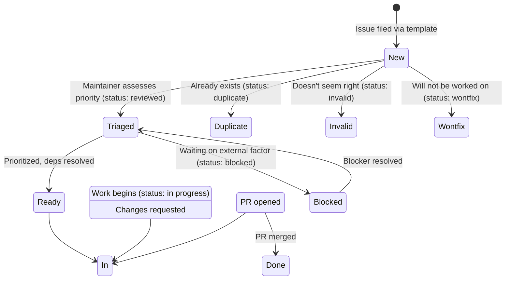
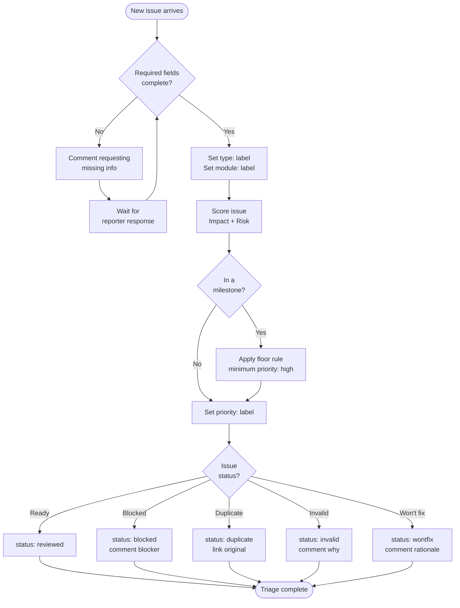

# Issue Triage Process

This document defines how issues are triaged, prioritized, and managed in the `servicenow-sdk-go` repository.

---

## Overview

Triage is the process of reviewing new issues, assessing their priority, and ensuring they're ready for work.

**Key principles:**
- Every issue gets a priority label during triage
- Priority is based on a repeatable rubric, not gut feeling
- Status labels track workflow state; priority labels track importance
- Milestone membership is a priority signal, not a duplicate taxonomy

---

## Issue Lifecycle

---

## Label Taxonomy

### Priority Labels (Scoring Rubric)

| Label              | Score | Description                     |
| ------------------ | ----- | ------------------------------- |
| `priority: urgent` | 6     | Blocks a release or active work |
| `priority: high`   | 5     | Should be picked up soon        |
| `priority: medium` | 4     | Worth doing, no rush            |
| `priority: low`    | 2-3   | Nice to have, no urgency        |

### Status Labels (Workflow State)

| Label                 | Meaning                                                    |
| --------------------- | ---------------------------------------------------------- |
| `status: new`         | Newly filed, not yet triaged                               |
| `status: reviewed`    | Triaged, ready for work                                    |
| `status: in progress` | Actively being worked on (auto-set when PR linked)         |
| `status: blocked`     | Blocked on another issue, decision, or external dependency |
| `status: duplicate`   | Already exists                                             |
| `status: invalid`     | Doesn't seem right                                         |
| `status: wontfix`     | Will not be worked on                                      |

### Type Labels

| Label                 | When to Use                                   |
| --------------------- | --------------------------------------------- |
| `type: bug`           | Something is broken or behaving unexpectedly  |
| `type: feature`       | New capability or enhancement                 |
| `type: refactor`      | Code quality improvement, no behavior change  |
| `type: documentation` | Docs, README, comments                        |
| `type: devops`        | CI/CD, workflows, scripts, tooling            |
| `type: epic`          | Large body of work tracked via linked stories |
| `type: test`          | Test infrastructure or coverage improvements  |

### Module Labels

Auto-applied by PR based on changed files. For issues, select from the "Affected Module / API" dropdown in the template.

---

## Priority Scoring Rubric

Score = **Impact + Risk-of-delay** (2-6 range)

### Impact (1-3)

How many consumers are affected, and how badly?

| Score | Description                                                                                                    |
| ----- | -------------------------------------------------------------------------------------------------------------- |
| 1     | Cosmetic, docs-only, or affects an edge case / rarely-used module                                              |
| 2     | Affects a commonly-used module (`tableapi`, `core`, `credentials`) or degrades DX without breaking correctness |
| 3     | Silent-failure / incorrect-behavior risk, a breaking change forced onto consumers, or blocks a milestone       |

### Risk-of-delay (1-3)

What gets worse the longer this sits?

| Score | Description                                                                                         |
| ----- | --------------------------------------------------------------------------------------------------- |
| 1     | Nothing; can sit indefinitely with no compounding cost                                              |
| 2     | Accumulates tech debt or blocks a handful of other open issues                                      |
| 3     | Free now and expensive forever after (breaking changes, naming decisions) or already in a milestone |

### Score to Priority Mapping

| Score | Priority           | Rationale                                            |
| ----- | ------------------ | ---------------------------------------------------- |
| 6     | `priority: urgent` | Both dimensions maxed                                |
| 5     | `priority: high`   | One dimension maxed, the other at 2                  |
| 4     | `priority: medium` | Both dimensions at 2, or a 3+1 split                 |
| 2-3   | `priority: low`    | Both dimensions minimal, or only one mildly elevated |

### Effort as Tie-Breaker

Effort (1-3) is **not** an input to the score. It's used only to order issues within the same priority tier (cheaper first).

| Score | Description                                                             |
| ----- | ----------------------------------------------------------------------- |
| 1     | Small, contained to one file/package, no design questions               |
| 2     | Spans a few packages or needs a design decision but not an ADR          |
| 3     | Cross-cutting, ADR-shaped, or touches request-builder/model conventions |

### Milestone Floor Rule

If an issue is in a milestone, its priority is **floored at `high`**, regardless of the raw score. This ensures milestone work is never buried under non-milestone noise.

- A milestone issue with Score 4 → `priority: high` (floored up)
- A milestone issue with Score 5 → `priority: high` (already at tier)
- A milestone issue with Score 6 → `priority: urgent` (stays at tier)

---

## Triage Workflow

### For the Maintainer

1. **Check the issue is complete**
   - Required fields filled (version, reproduction, expected behavior)
   - If incomplete: comment requesting missing info, add `status: new` (no priority yet)

2. **Classify the issue**
   - Set `type:` label (bug, feature, refactor, etc.)
   - Set `module:` label if clear from the template dropdown

3. **Score the issue**
   - Assess Impact (1-3)
   - Assess Risk-of-delay (1-3)
   - Calculate score = Impact + Risk
   - Apply milestone floor rule if applicable
   - Set `priority:` label based on score table

4. **Set status**
   - If ready for work: `status: reviewed`
   - If blocked: `status: blocked` + comment explaining blocker
   - If duplicate: `status: duplicate` + link to original
   - If invalid: `status: invalid` + comment explaining why
   - If won't fix: `status: wontfix` + comment explaining rationale

5. **Optional: Set effort**
   - Use the `Size` field on the project board (XS/S/M/L/XL)
   - Map rubric Effort 1→S, 2→M, 3→L

### Re-scoring Triggers

Revisit an issue's priority when:
- The issue receives new comments that change its scope
- A PR references the issue and the actual work differs from the estimate
- The issue is reopened after being closed
- A milestone's scope changes

---

## Quick Reference

### Scoring Example

**Issue: "Bug in tableapi pagination returns wrong cursor"**

- **Impact**: 3 (affects commonly-used module, incorrect behavior)
- **Risk-of-delay**: 2 (accumulates tech debt, blocks users)
- **Score**: 5 → `priority: high`

**Issue: "Add license headers to Go files"**

- **Impact**: 1 (cosmetic, no behavior change)
- **Risk-of-delay**: 1 (can sit indefinitely)
- **Score**: 2 → `priority: low`

**Issue: "Error types should be in errors/ package" (in v2.0.0 milestone)**

- **Impact**: 2 (affects DX, not correctness)
- **Risk-of-delay**: 3 (breaking change, free now, expensive after release)
- **Score**: 5 → `priority: high` (already at tier)
- **Milestone floor**: No change (5 ≥ high threshold)

### Common Mistakes

1. **Don't** use Effort as an input to priority. A cheap fix isn't automatically high priority.
2. **Don't** force all milestone issues to `urgent`. Use the floor rule to differentiate.
3. **Don't** skip scoring because "it's obviously important." The rubric exists for consistency.
4. **Don't** leave issues without a priority label after triage. Every issue needs one.

---

## References

- [Issue Prioritization System Proposal](proposals/issue-prioritization-system.md)
- [Project Management Redesign](proposals/project-management-system-redesign.md)
- [Contributing Guide](../website/docs/contributing/conventions.md)
