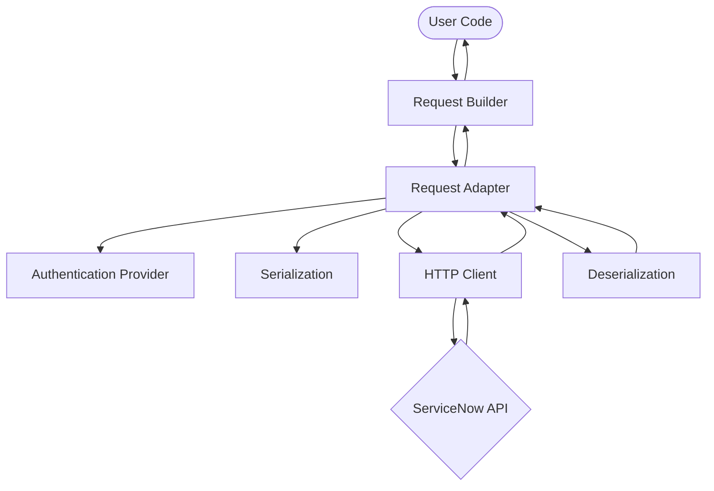

# Architecture

The ServiceNow SDK for Go is designed as a thin, high-performance wrapper around
the ServiceNow REST APIs. It utilizes the **Microsoft Kiota** framework to
provide a consistent, type-safe development experience.

## System overview

The SDK follows a layered architecture where each component has a specific
responsibility in the request-response lifecycle.

## Core components

### Request builders

Request builders provide the primary "fluent" interface for the SDK. They map
directly to the ServiceNow API hierarchy. For example, the path
`client.Now2().TableV2("incident")` corresponds to the `/api/now/table/incident`
endpoint.

Builders are responsible for:
- Constructing the URL based on path parameters.
- Providing methods for HTTP operations (GET, POST, etc.).
- Offering type-safe request and response models.

### Request adapter

The `RequestAdapter` is the engine of the SDK. It coordinates between the
builders and the underlying networking and serialization layers.

It handles:
- **URL Template Expansion:** Injecting parameters into Kiota URL templates.
- **Authentication:** Calling the registered provider to add authorization
  headers.
- **Serialization:** Converting Go structs into JSON for request bodies.
- **Request Execution:** Passing the final request to the HTTP client.

### Authentication providers

Located in the `credentials/` package, these providers manage the `Authorization`
header. They support various methods, including Basic Auth and OAuth2. The
adapter calls the provider for every request, allowing for dynamic token
refreshes.

## Request lifecycle

When you execute a method like `Get()`, the following sequence occurs:

1.  **Build:** The Request Builder creates a `RequestInformation` object
    containing the URL, method, and headers.
2.  **Authorize:** The Request Adapter asks the Authentication Provider to
    apply credentials to the request.
3.  **Serialize:** If there is a request body, the Serialization layer converts
     the Go model into JSON.
4.  **Send:** The HTTP client transmits the request to ServiceNow.
5.  **Deserialize:** The response JSON is converted back into the appropriate
    Go model (or an error object if the status code indicates failure).

## Design patterns

- **Fluent interface:** Prioritizes readability and discoverability through IDE
  autocompletion.
- **Generics (V2):** Uses Go generics in the V2 modules to provide compile-time
  type safety for API responses.
- **Modular design:** Each API module (Table, Attachment, Batch) is independent,
  minimizing the library's footprint.
- **Dependency injection:** The HTTP client and authentication providers can
  be customized or mocked for testing.
