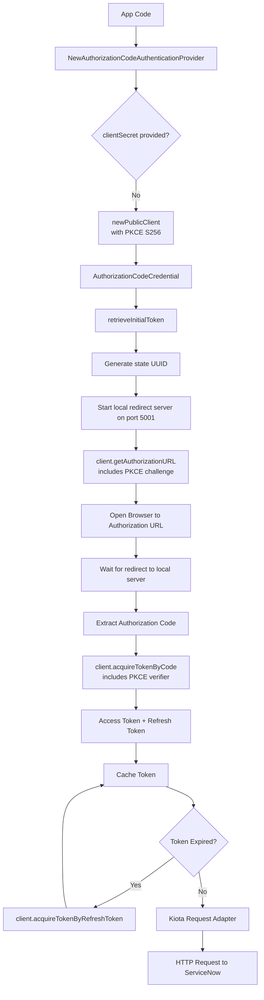

# Authorization code (public)

The Authorization Code (public) flow works for applications that
authenticate users interactively but can't securely store a client secret
(for example, SPAs, mobile apps, CLI tools).

## Objective

Configure and use the Authorization Code (public) OAuth flow with the
Service‑Now SDK using values provided by your ServiceNow administrator.

## Required values

Your administrator must provide:

| Value             | Description                                          |
| ----------------- | ---------------------------------------------------- |
| Service‑Now URL   | Base URL of the instance                             |
| Client ID         | From a ServiceNow OAuth application registry entry   |
| Redirect URL      | Must match the redirect URL configured in ServiceNow |
| Authorization URL | OAuth authorization endpoint                         |
| Token URL         | OAuth token endpoint                                 |

## SDK flow



## Initialize the SDK

```golang
import (
    "log"

    credentials "github.com/michaeldcanady/service-now-sdk/credentials"
    servicenow "github.com/michaeldcanady/service-now-sdk"
)

func main() {
    authority := credentials.NewInstanceAuthority("{instance}")

    cred, err := credentials.NewAuthorizationCodeAuthenticationProvider(
        clientID,
        "", // No client secret for public clients
        authority,
        []string{string(authority)},
    )
    if err != nil {
        log.Fatal(err)
    }

    clientOpts := []credentials.ServiceNowServiceClientOption{
        servicenow.WithAuthenticationProvider(cred),
        servicenow.WithInstance("{instance}"),
    }

    client, err := servicenow.NewServiceNowServiceClient(clientOpts...)
    if err != nil {
        log.Fatal(err)
    }
}
```
