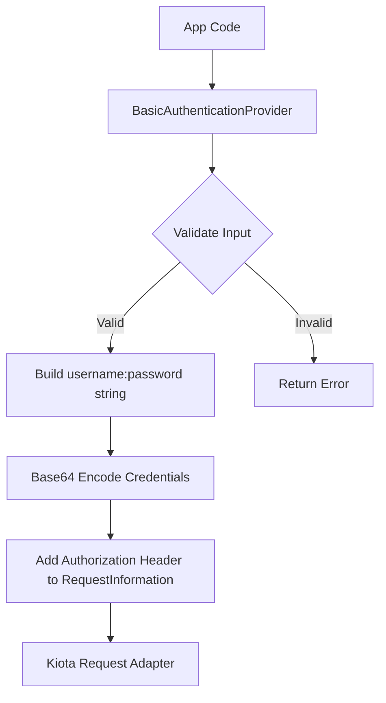

# Basic Authentication

Basic Authentication uses a ServiceNow username and password to authenticate
API calls. It is simple to configure but should be used primarily for
development, testing, or tightly controlled system‑to‑system integrations.

## Objective

Configure and use Basic Authentication with the Service‑Now SDK using values
provided by your ServiceNow administrator.

## Required values

Your administrator must provide:

| Value           | Description                 |
| --------------- | --------------------------- |
| Service‑Now URL | Base URL of the instance    |
| Username        | Integration user’s username |
| Password        | Integration user’s password |

## SDK Flow



## Initialize the SDK

```golang
import (
    "log"

    credentials "github.com/michaeldcanady/service-now-sdk/credentials"
    servicenow "github.com/michaeldcanady/service-now-sdk"
)

func main() {
    clientOpts := []credentials.ServiceNowServiceClientOption{
        servicenow.WithAuthenticationProvider(
            credentials.NewBasicAuthenticationProvider(username, password),
        ),
        servicenow.WithInstance("{instance}"),
    }

    client, err := servicenow.NewServiceNowServiceClient(clientOpts...)
    if err != nil {
        log.Fatal(err)
    }

    // Client is now authenticated and ready to use
}
```
