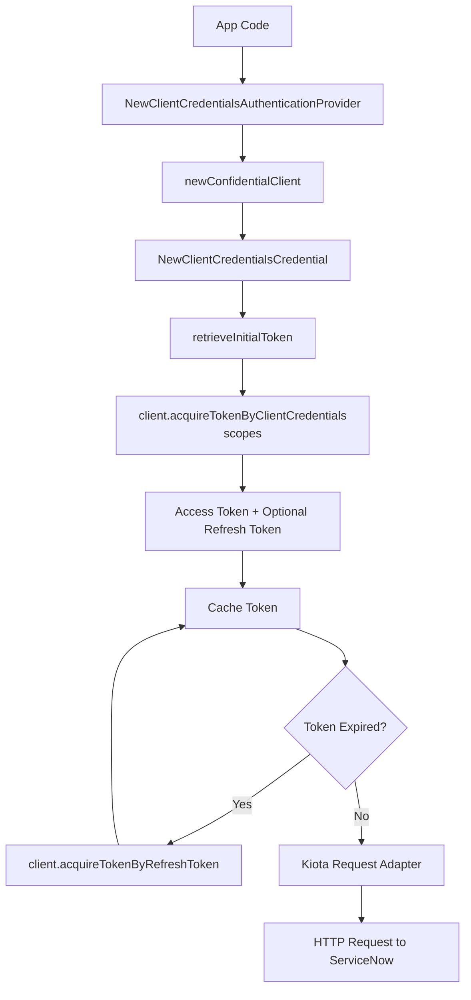

# Client Credentials

The Client Credentials flow is designed for server‑to‑server integrations where
no user is involved. The SDK authenticates using a client ID and client secret,
and ServiceNow issues an access token representing the application itself.

## Objective

Configure and use the Client Credentials OAuth flow with the Service‑Now SDK
using values provided by your ServiceNow administrator.

## Required values

Your administrator must provide:

| Value           | Description                                        |
| --------------- | -------------------------------------------------- |
| Service‑Now URL | Base URL of the instance                           |
| Client ID       | From a ServiceNow OAuth application registry entry |
| Client Secret   | From the same registry entry                       |

## SDK FLow




## Initialize the SDK

```golang
import (
    "log"

    credentials "github.com/michaeldcanady/service-now-sdk/credentials"
    servicenow "github.com/michaeldcanady/service-now-sdk"
)

func main() {
    authority := credentials.NewInstanceAuthority("{instance}")

    cred, err := credentials.NewClientCredentialsAuthenticationProvider(
        clientID,
        clientSecret,
        authority,
        []string{string(authority)},
    )
    if err != nil {
        log.Fatal(err)
    }

    clientOpts := []credentials.ServiceNowServiceClientOption{
        servicenow.WithAuthenticationProvider(cred),
        servicenow.WithInstance("{instance}"),
    }

    client, err := servicenow.NewServiceNowServiceClient(clientOpts...)
    if err != nil {
        log.Fatal(err)
    }

    // Client is now authenticated and ready to use
}
```
