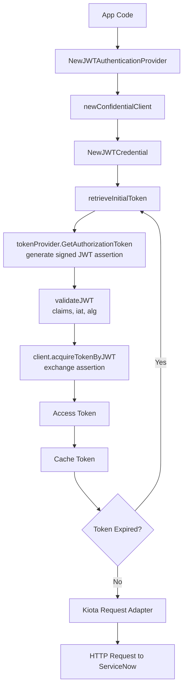

# JWT token authentication

JWT Token authentication lets the SDK authenticate using a signed JSON Web
Token (JWT). ServiceNow validates the signature using a public key configured in
your instance and issues an access token. This method is ideal for secure,
non‑interactive server‑to‑server integrations.

## Objective

Configure and use JWT Token authentication with the Service‑Now SDK using values
provided by your ServiceNow administrator.

## Required values

Your administrator must provide:

| Value           | Description                                   |
| --------------- | --------------------------------------------- |
| Service‑Now URL | Base URL of the instance                      |
| Client ID       | From a ServiceNow OAuth or JWT registry entry |
| Client Secret   | Required by ServiceNow for JWT Bearer flows   |

Your application must also provide:

- **Private key** used to sign the JWT assertion
- A **token provider** capable of generating signed JWT assertions

## SDK flow




## Initialize the SDK

```golang
import (
    "log"

    credentials "github.com/michaeldcanady/service-now-sdk/credentials"
    servicenow "github.com/michaeldcanady/service-now-sdk"
)

func main() {
    authority := credentials.NewInstanceAuthority("{instance}")

    // tokenProvider must generate signed JWT assertions
    // this is a user provided provider and needs to match kiota's authentication.AccessTokenProvider
    tokenProvider := myJWTAssertionProvider()

    cred, err := credentials.NewJWTAuthenticationProvider(
        clientID,
        clientSecret,
        tokenProvider,
        authority,
        []string{string(authority)},
    )
    if err != nil {
        log.Fatal(err)
    }

    clientOpts := []credentials.ServiceNowServiceClientOption{
        servicenow.WithAuthenticationProvider(cred),
        servicenow.WithInstance("{instance}"),
    }

    client, err := servicenow.NewServiceNowServiceClient(clientOpts...)
    if err != nil {
        log.Fatal(err)
    }

    // Client is now authenticated and ready to use
}
```
