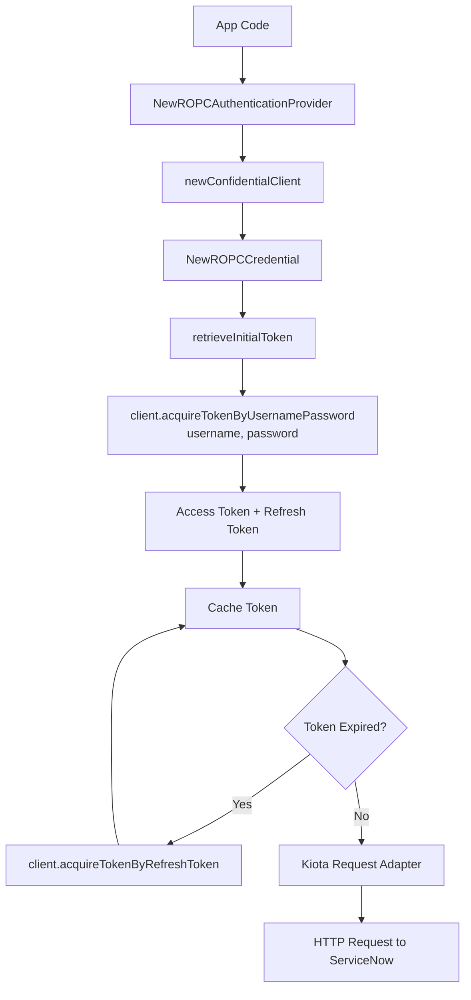

# Resource Owner Password Credentials (ROPC)

The Resource Owner Password Credentials (ROPC) flow allows the SDK to exchange a
username and password for an OAuth access token. This method is typically used
only in controlled environments or legacy integrations where interactive login
is not possible.

## Objective

Configure and use the ROPC OAuth flow with the Service‑Now SDK using values
provided by your ServiceNow administrator.

## Required values

Your administrator must provide:

| Value           | Description                                        |
| --------------- | -------------------------------------------------- |
| Service‑Now URL | Base URL of the instance                           |
| Client ID       | From a ServiceNow OAuth application registry entry |
| Client Secret   | From the same registry entry                       |
| Username        | ServiceNow user account used for authentication    |
| Password        | Password for the user account                      |

## SDK Flow




## Initialize the SDK

```golang
import (
    "log"

    credentials "github.com/michaeldcanady/service-now-sdk/credentials"
    servicenow "github.com/michaeldcanady/service-now-sdk"
)

func main() {
    authority := credentials.NewInstanceAuthority("{instance}")

    cred, err := credentials.NewROPCAuthenticationProvider(
        clientID,
        clientSecret,
        username,
        password,
        authority,
        []string{string(authority)},
    )
    if err != nil {
        log.Fatal(err)
    }

    clientOpts := []credentials.ServiceNowServiceClientOption{
        servicenow.WithAuthenticationProvider(cred),
        servicenow.WithInstance("{instance}"),
    }

    client, err := servicenow.NewServiceNowServiceClient(clientOpts...)
    if err != nil {
        log.Fatal(err)
    }

    // Client is now authenticated and ready to use
}
```
