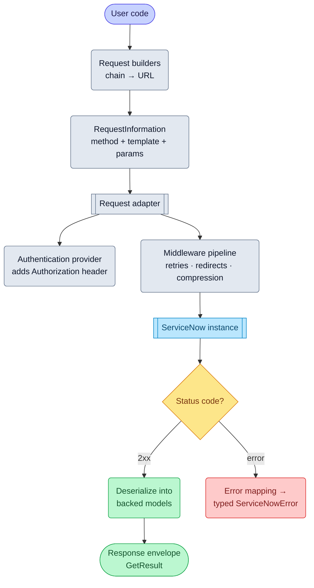

# Architecture

The fastest way to understand this SDK is to follow one request all the way
through it. This page does exactly that, then maps what you saw onto the
repository so you know where to make your change.

First, the shape of the thing: the SDK is **hand-written on Kiota**. Microsoft's
Kiota runtime supplies the machinery — URI templates, auth plumbing,
serialization registries, retry middleware — and this repo hand-writes the
ServiceNow-specific surface on top, deliberately mimicking the conventions of
Kiota-*generated* SDKs like msgraph-sdk-go
([why?](design-hand-written-kiota.md)). Keep that in mind throughout: whenever
a component seems to exist "just because", the answer is usually "because
that's how Kiota SDKs work, and familiarity is the feature."

## The life of a request

Say a user writes:

```go
record, err := client.Now().Table("incident").ByID(sysID).Get(ctx, config)
```



**1. The chain builds a URL, lazily.** Each call — `Now()`, `Table(...)`,
`ByID(...)` — constructs a child *request builder*: it clones the parent's
path parameters, adds its own, and carries the same request adapter. Nothing
has been sent; a builder is just an address. This is why builders are cheap to
create and safe to store.

**2. The verb method turns the address into a request.** `Get` first runs the
nil-guard prologue (returning shared sentinels like
`snerrors.ErrNilRequestBuilder` — [why sentinels?](design-error-handling.mdx)),
then builds a Kiota `RequestInformation`: HTTP method, the builder's URI
template, and the caller's `RequestConfiguration` applied as headers and query
parameters. Body-carrying verbs also serialize the model here via
`SetContentFromParsable`.

**3. The adapter executes it.** The request adapter is the engine: it expands
the URI template, asks the **authentication provider** (from `credentials/`)
to stamp the `Authorization` header — every request, which is how token
refresh stays invisible — and pushes the request through the **middleware
pipeline** (retries with backoff, redirects, compression) to the instance.

**4. The response becomes typed data — or a typed error.** On a failure
status, the error mapping passed by every verb method
(`core.DefaultErrorMapping()`) turns the body into a typed
`*core.ServiceNowError` subtype. On success, the body deserializes into
**backed models** — property data lives in a change-tracking backing store,
not struct fields ([why?](design-backed-models.md)) — wrapped in a response
envelope the user unwraps with `GetResult()`.

That's the whole machine. Every API module is this same loop with different
URLs and models.

## Where things live

| Path | What it is | When you touch it |
| ---- | ---------- | ----------------- |
| `*api/` (e.g. `tableapi/`) | One package per ServiceNow API; request builders, models, per-verb configurations | Adding or changing an API surface — see the [playbook](add-api-module.md) |
| `core/` | The shared skeleton: `BaseRequestBuilder`, `BaseModel`, response envelopes, error mapping, page iterator | Rarely — changes here ripple through every module |
| `internal/` | Implementation helpers (nil-checks, store accessors, serialization generators, query AST) — never imported by consumers | When a pattern repeats across modules and deserves a helper |
| `credentials/` | Authentication providers (Basic + the OAuth2 flows) | Auth features and fixes |
| `errors/` | The shared sentinel errors (`snerrors`) | Almost never — reuse, don't add |
| `tests/integration/`, `tests/e2e/` | Godog BDD suites and live-instance tests | See the [testing guide](testing.md) |
| `website/` | This documentation site, including compiled Go samples in `website/snippets/` | Any PR that changes what users see |
| `docs/adr/`, `docs/blueprints/` | Architecture decision records and per-module design blueprints | Design changes and new modules |

Two rules of thumb fall out of this layout:

- **Compose, don't reinvent.** If you're writing a nil-check, a property
  accessor, or serialization plumbing inside a module, stop — `internal/`
  almost certainly has the helper, and using it is what keeps modules
  identical.
- **`tableapi/` is the reference implementation.** Fullest verb coverage,
  paging, generics. When you're unsure what a new file should look like, look
  there first (`policyapi/` is the minimal counterpart).

## Design patterns you'll be held to

- **Fluent interface** — discoverability through chaining and IDE completion.
- **Generics** — `RequestBuilder[T model.ServiceNowItem]` gives compile-time
  safety for response types.
- **Per-verb configuration types** — invalid options are uncompilable, not
  runtime surprises.
- **Dependency injection** — the HTTP client, middleware, and auth provider
  are all swappable, which is also what makes everything mockable in tests.

The *why* behind these lives in [the design decisions](design-decisions.md)
— each one backed by an ADR in `docs/adr/`:

- [Why hand-written on Kiota?](design-hand-written-kiota.md)
- [Why aren't models plain structs?](design-backed-models.md)
- [Why sentinel errors everywhere?](design-error-handling.mdx)
