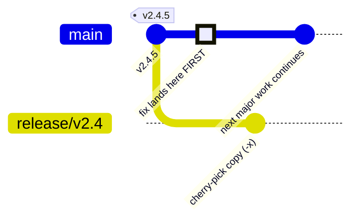

# Release branches & cross-major flow

At most points in this project's life, two major lines are alive at once:
`main` develops the next major, while consumers stay pinned to shipped ones.
This page explains where your change lands, how patches and features reach an
older major, and the rules that exist because we already lived the failure
mode once — during the v1→v2 transition, `main` and `release/v2` drifted so
far apart they effectively became different codebases.

The deep rationale lives in [ADR 011](https://github.com/michaeldcanady/servicenow-sdk-go/blob/main/docs/adr/011-release-branches-and-cross-major-flow.md);
this page is the day-to-day version.

## The mental model

Four rules explain almost every decision on this page:

| Rule | Meaning |
| --- | --- |
| `main` is next-major trunk | All new development lands on `main`, always. It's the tip of the next major version. |
| Tags are cut points | Releases are tagged; branches merely give tags a place to grow from. You can branch from a tag at any time — even years later — so branches are created **only when first needed**, never preemptively. |
| Maintenance branches flow downstream | A `release/vX.Y` branch only ever receives changes that came from (or are accounted to) `main`. It's never a second development trunk. |
| Drift must be tracked, never silent | Every change that reaches a maintenance branch without coming from `main` automatically opens a tracking issue demanding an explicit port-or-won't-port decision. |



## Creating a maintenance branch

Create one only when something real needs it: a critical fix, a security
patch, or an old-major-only feature. Cut it from the **last tag** of that
minor line, not from `main`:

```bash
git fetch --tags
git branch release/v2.4 v2.4.5
git push origin release/v2.4
```

Naming rules:

- `release/vX.Y` — major plus **minor**, no patch segment.
- One branch per actively-patched minor line — in practice, the latest
  minor of each supported major. If a feature release ships `v2.5.0` from a
  `release/v2.4` branch, later `v2.5.*` patches get a fresh
  `release/v2.5` cut at `v2.5.0`; the older branch is retired unless it
  still has patch work in flight.
- Never create a branch "for symmetry" or ahead of need. An idle long-lived
  branch is how silent drift starts.

## Where does my change land?

| Your change | Lands on |
| --- | --- |
| Bug fix, dependency bump, doc fix affecting both majors | `main`, then backport (next section) |
| New ServiceNow feature useful for both majors, small/portable | `main`, then port down to `release/vX.Y` |
| New ServiceNow feature useful for both majors, but touching core code that has diverged between majors | `main` only, unless consumer demand justifies the port cost — document the decision in the PR |
| Feature that only makes sense on the old major (depends on prior-major model shapes) | `release/vX.Y` directly — see [old-major-only features](#landing-an-old-major-only-feature) |
| Anything else speculative | Don't. Ask in an issue first. |

## Backporting fixes (`main` → `release/vX.Y`)

Fixes land on `main` first, always — even if the reporter is stuck on the
old major. Then:

1. Add the label **`backport release/vX.Y`** to the merged PR (or ask a
   maintainer to).
2. Automation (#656) opens a cherry-pick PR against the maintenance branch.
3. Review and merge it like any other PR. Required CI runs there too.

When the cherry-pick conflicts — common across majors — expect the import
paths to be the culprit: every file's module suffix differs
(`/v3/...` vs `/v2/...`). Rewrite the suffix mechanically, resolve the
remainder by hand, and keep backport PRs small enough that this stays
tractable. A fix too tangled to port cheaply is a signal to discuss whether
it should be ported at all, not a reason to force it.

Direct pushes to `release/*` are blocked. Everything arrives by PR.

## Landing an old-major-only feature

Sometimes a new ServiceNow capability should ship to consumers who can't
move majors yet. When the feature depends on prior-major shapes:

1. Branch `feat/<name>-v2` off `release/v2.4` and open the PR **against the
   release branch**.
2. Use Conventional Commits as everywhere else — a `feat:` merge bumps the
   maintenance line's **minor** (`v2.(Y+1).0`), a `fix:` bumps the patch.
   `release-please` opens the release PR from the alternate config (#659);
   never hand-edit `VERSION` or `CHANGELOG.md` on any branch.
3. Because this change didn't come from `main`, automation immediately
   opens a **`needs-forward-port`** issue asking whether the feature should
   also reach `main`. That's expected and fine — see next section.

## Forward-port tracking (`release/vX.Y` → `main`)

Any merge into `release/v*` without backport provenance triggers a
`needs-forward-port` issue ("assess porting #N to `main`"). Closing it
takes exactly one of two actions:

- **Port it**: open the matching PR against `main` (import suffix goes the
  other direction this time), and close the issue with its number.
- **Decline it**: close the issue with a short written rationale, for
  example: "v3 replaced the model layer this builds on." A recorded decision
  is progress; silence is drift.

This is the mechanism that makes the one exception to "downstream-only"
safe: divergence can happen, but it can never happen invisibly.

## Worked example: A new ServiceNow API ships today

`main` is mid-v3-development. ServiceNow publishes a new endpoint, and v2
users are asking for it now.

**Path A — both majors want it (the usual case):**

1. Build the module on `main` against `/v3`, following the
   [module playbook](add-api-module.md). It ships in the next v3 release.
2. Cut `release/v2.4` from the latest `v2.*` tag if it doesn't exist yet.
3. Open a second PR carrying the same package to `release/v2.4`, rewriting
   import suffixes `/v3` → `/v2`. New modules port well — they're
   self-contained packages.
4. Both lines ship the capability; the two PRs reference each other.

**Path B — v2-only by design:** the feature leans on v2-era model shapes,
or v3 has restructured the area it touches. Land it directly on
`release/v2.4` (previous section); answer the resulting
`needs-forward-port` issue honestly — "will port once v3 settles" or
"won't port because…" are both acceptable answers.

Either way, batch the release: maintenance releases are demand-driven, not
one-tag-per-merge.

## Hard rules

- ❌ No direct pushes to `release/*` (branch protection, #658) — PRs only,
  required CI green.
- ❌ No preemptive `release/*` branches.
- ❌ No feature development on a maintenance branch without accepting the
  forward-port assessment that follows it.
- ❌ No independent parallel implementation of the same concept on two
  major lines — one PR per concept per direction, cross-referenced.
- ❌ Never hand-edit `VERSION` or `CHANGELOG.md` — on any branch.
- ✅ Fixes on `main` first, labels second, cherry-pick third.

## Retiring a maintenance branch

Support windows are deliberate, not accidental (ADR 011, rule 7).
Vocabulary: *current* means the highest tagged major; *prior* means any
tagged major below it.

- The current major's latest minor receives fixes **and** selected features.
- The transition is explicit: the day the successor major tags its **first
  stable release**, every prior major drops to critical/security fixes only.
  Until that tag exists, the latest released major stays feature-eligible —
  that window is what makes [old-major-only features](#landing-an-old-major-only-feature)
  possible while the next major is still in development.
- At end of support, the `release/*` branch is deleted and the retirement
  is announced in the release notes. If a maintenance branch starts feeling
  like active development again, that's the signal to revisit the EOL clock
  — not to keep growing the branch.

:::note[Status]
The automation described here (backport label action, forward-port tracker,
maintenance-line release job, branch protection) lands incrementally; until
each piece exists, perform its step manually and say so in the PR
description. Tracking issues live under the
[`type: devops`](https://github.com/michaeldcanady/servicenow-sdk-go/issues?q=is%3Aopen+label%3A%22type%3A+devops%22)
label.
:::
