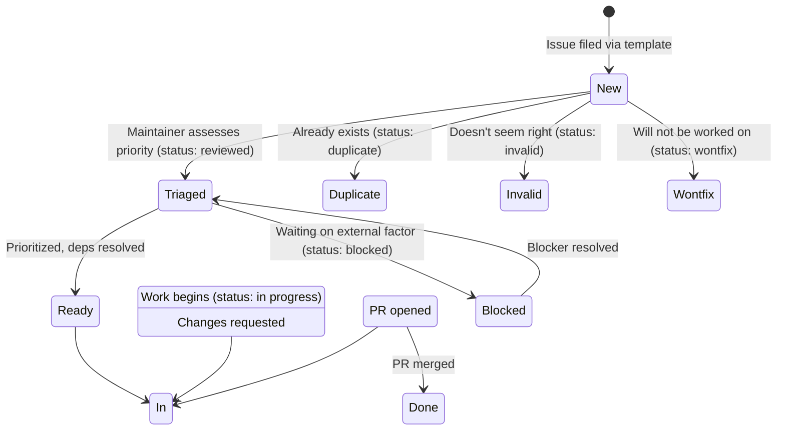
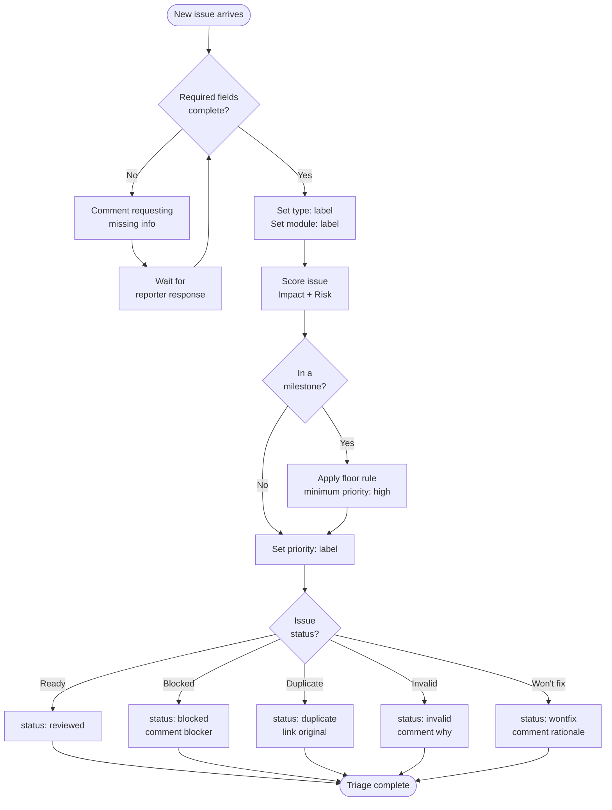

# Issue triage

Triage turns a newly filed issue into prioritized, ready-for-work (or
correctly closed) state. The process exists so priority reflects a
repeatable rubric, not gut feeling:

- Every issue gets a priority label during triage.
- Status labels track workflow state; priority labels track importance.
- Milestone membership is a priority signal, not a duplicate taxonomy.

Contributors mostly need the [label taxonomy](#label-taxonomy) — it's what
you see on issues. Maintainers follow the full [workflow](#triage-workflow).

## Issue lifecycle

## Label taxonomy

### Priority labels (scoring rubric)

| Label              | Score | Description                     |
| ------------------ | ----- | ------------------------------- |
| `priority: urgent` | 6     | Blocks a release or active work |
| `priority: high`   | 5     | Should be picked up soon        |
| `priority: medium` | 4     | Worth doing, no rush            |
| `priority: low`    | 2-3   | Nice to have, no urgency        |

### Status labels (workflow state)

| Label                 | Meaning                                                    |
| --------------------- | ---------------------------------------------------------- |
| `status: new`         | Newly filed, not yet triaged                               |
| `status: reviewed`    | Triaged, ready for work                                    |
| `status: in progress` | Actively being worked on (auto set when a PR is linked)    |
| `status: blocked`     | Blocked on another issue, decision, or external dependency |
| `status: duplicate`   | Already exists                                             |
| `status: invalid`     | Doesn't seem right                                         |
| `status: wontfix`     | Won't be worked on                                         |

### Type labels

| Label                 | When to use                                   |
| --------------------- | --------------------------------------------- |
| `type: bug`           | Something is broken or behaving unexpectedly  |
| `type: feature`       | New capability or enhancement                 |
| `type: refactor`      | Code quality improvement, no behavior change  |
| `type: documentation` | Docs, README, comments                        |
| `type: devops`        | CI/CD, workflows, scripts, tooling            |
| `type: epic`          | Large body of work tracked via linked stories |
| `type: test`          | Test infrastructure or coverage improvements  |

### Module labels

Auto applied to PRs based on changed files. For issues, select from the
"Affected Module / API" dropdown in the issue template.

## Priority scoring rubric

Score = **Impact + Risk-of-delay**, giving a 2–6 range.

### Impact (1–3)

How many consumers are affected, and how badly?

| Score | Description                                                                                                    |
| ----- | -------------------------------------------------------------------------------------------------------------- |
| 1     | Cosmetic, docs-only, or affects an edge case / rarely-used module                                              |
| 2     | Affects a commonly-used module (`tableapi`, `core`, `credentials`) or degrades DX without breaking correctness |
| 3     | Silent-failure / incorrect-behavior risk, a breaking change forced onto consumers, or blocks a milestone       |

### Risk-of-delay (1–3)

What gets worse the longer this sits?

| Score | Description                                                                                         |
| ----- | --------------------------------------------------------------------------------------------------- |
| 1     | Nothing; can sit indefinitely with no compounding cost                                              |
| 2     | Accumulates tech debt or blocks a handful of other open issues                                      |
| 3     | Free now and expensive forever after (breaking changes, naming decisions) or already in a milestone |

### Score-to-priority mapping

| Score | Priority           | Rationale                                            |
| ----- | ------------------ | ---------------------------------------------------- |
| 6     | `priority: urgent` | Both dimensions maxed                                |
| 5     | `priority: high`   | One dimension maxed, the other at 2                  |
| 4     | `priority: medium` | Both dimensions at 2, or a 3+1 split                 |
| 2-3   | `priority: low`    | Both dimensions minimal, or only one mildly elevated |

### Effort as tie-breaker

Effort (1–3) **isn't** an input to the score. Use it only to order issues
within the same priority tier (cheaper first).

| Score | Description                                                             |
| ----- | ----------------------------------------------------------------------- |
| 1     | Small, contained to one file/package, no design questions               |
| 2     | Spans a few packages or needs a design decision but not an ADR          |
| 3     | Cross-cutting, ADR-shaped, or touches request-builder/model conventions |

### Milestone floor rule

If an issue is in a milestone, its priority is **floored at `high`**,
regardless of the raw score, so milestone work is never buried under
non-milestone noise:

- Milestone issue with score 4 → `priority: high` (floored up)
- Milestone issue with score 5 → `priority: high` (already at tier)
- Milestone issue with score 6 → `priority: urgent` (stays at tier)

## Triage workflow

### Steps

1. **Check the issue is complete.** Required fields filled (version,
   reproduction, expected behavior)? If incomplete: comment requesting the
   missing info, leave `status: new`, set no priority yet.
2. **Classify.** Set the `type:` label; set the `module:` label if the
   template dropdown didn't already make it clear.
3. **Score.** Assess Impact (1–3) and Risk-of-delay (1–3), sum them, apply
   the milestone floor rule if applicable, set the `priority:` label.
4. **Set status:** `status: reviewed` when ready for work; `status: blocked`
   plus a comment explaining the blocker; or `duplicate` / `invalid` /
   `wontfix` each with a comment linking the original or explaining why.
5. **Optionally set effort** using the `Size` field on the project board:
   rubric effort 1 → S, 2 → M, 3 → L.

### Re-scoring triggers

Revisit an issue's priority when:

- New comments change its scope.
- A PR references it and the actual work differs from the estimate.
- It's reopened after being closed.
- A milestone's scope changes.

## Quick reference

### Worked examples

**Bug in tableapi pagination returns wrong cursor**

- Impact: 3 (commonly-used module, incorrect behavior)
- Risk-of-delay: 2 (accumulates tech debt, blocks users)
- Score: 5 → `priority: high`

**Add license headers to Go files**

- Impact: 1 (cosmetic, no behavior change)
- Risk-of-delay: 1 (can sit indefinitely)
- Score: 2 → `priority: low`

**Error types should be in errors/ package (in a release milestone)**

- Impact: 2 (affects DX, not correctness)
- Risk-of-delay: 3 (breaking change, free now, expensive after release)
- Score: 5 → `priority: high`
- Milestone floor: no change (5 ≥ high threshold)

### Common mistakes

1. **Don't** use Effort as an input to priority. A cheap fix isn't
   automatically high priority.
2. **Don't** force all milestone issues to `urgent`. Use the floor rule to
   differentiate.
3. **Don't** skip scoring because "it's obviously important." The rubric
   exists for consistency.
4. **Don't** leave issues without a priority label after triage. Every
   issue needs one.

## Where this fits

The [conventions reference](conventions.md) summarizes these labels alongside
everything else reviewers and contributors touch daily. PR-linked status
automation (`Closes #N` moving an issue to `status: in progress`) is described
there too.
