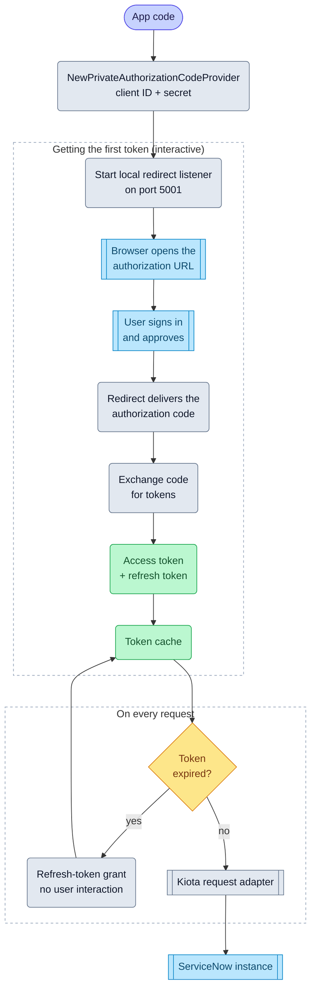

# Authorization code (private)

import GoSnippet from '@site/src/components/GoSnippet';
import authGo from '@site/snippets/auth.go';

The Authorization Code (private) flow works for applications that can
securely store a client secret (for example, server-side services, desktop apps). A user
authenticates interactively, and the SDK exchanges the authorization code for
tokens.

## Objective

Configure and use the Authorization Code (private) OAuth flow with the
Service‑Now SDK using values provided by your ServiceNow administrator.

## Required values

Your administrator must provide:

| Value             | Description                                          |
| ----------------- | ---------------------------------------------------- |
| Service‑Now URL   | Base URL of the instance                             |
| Client ID         | From a ServiceNow OAuth application registry entry   |
| Client Secret     | From the same registry entry                         |
| Redirect URL      | Must match the redirect URL configured in ServiceNow |
| Authorization URL | OAuth authorization endpoint                         |
| Token URL         | OAuth token endpoint                                 |

## SDK flow

## Initialize the SDK

<GoSnippet language="go" src={authGo} region="auth_code_private" />
