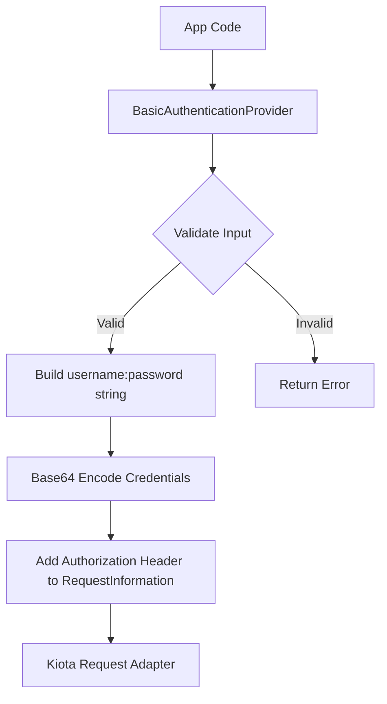

# Basic authentication

Basic Authentication uses a ServiceNow username and password to authenticate
API calls. it's simple to configure, but use it primarily for
development, testing, or controlled system‑to‑system integrations.

## Objective

Configure and use Basic Authentication with the Service‑Now SDK using values
provided by your ServiceNow administrator.

## Required values

Your administrator must provide:

| Value           | Description                 |
| --------------- | --------------------------- |
| Service‑Now URL | Base URL of the instance    |
| Username        | Integration user’s username |
| Password        | Integration user’s password |

## SDK flow



## Initialize the SDK

```go
import (
    "log"

    servicenowsdkgo "github.com/michaeldcanady/servicenow-sdk-go"
    "github.com/michaeldcanady/servicenow-sdk-go/credentials"
)

func main() {
    cred := credentials.NewBasicProvider("{username}", "{password}")

    client, err := servicenowsdkgo.NewServiceNowServiceClient(
        servicenowsdkgo.WithAuthenticationProvider(cred),
        servicenowsdkgo.WithInstance("{instance}"),
    )
    if err != nil {
        log.Fatal(err)
    }

    // Client is now authenticated and ready to use
    _ = client
}
```
