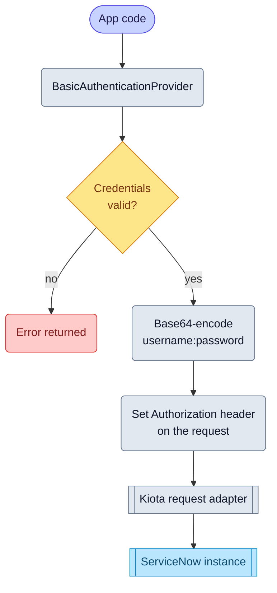

# Basic authentication

import GoSnippet from '@site/src/components/GoSnippet';
import authGo from '@site/snippets/auth.go';

Basic Authentication uses a ServiceNow username and password to authenticate
API calls. it's simple to configure, but use it primarily for
development, testing, or controlled system‑to‑system integrations.

## Objective

Configure and use Basic Authentication with the Service‑Now SDK using values
provided by your ServiceNow administrator.

## Required values

Your administrator must provide:

| Value           | Description                 |
| --------------- | --------------------------- |
| Service‑Now URL | Base URL of the instance    |
| Username        | Integration user’s username |
| Password        | Integration user’s password |

## SDK flow

## Initialize the SDK

<GoSnippet language="go" src={authGo} region="auth_basic_full" />
