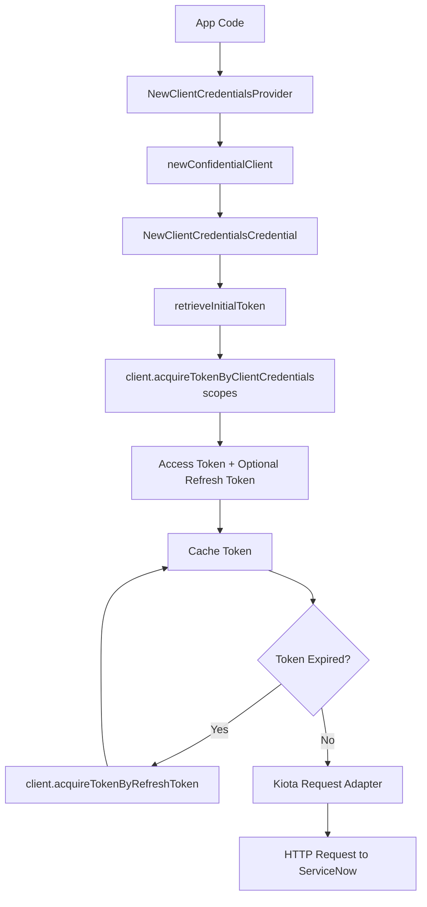

# Client credentials

The Client Credentials flow works for server‑to‑server integrations where
no user participates. The SDK authenticates using a client ID and client secret,
and ServiceNow issues an access token representing the application itself.

## Objective

Configure and use the Client Credentials OAuth flow with the Service‑Now SDK
using values provided by your ServiceNow administrator.

## Required values

Your administrator must provide:

| Value           | Description                                        |
| --------------- | -------------------------------------------------- |
| Service‑Now URL | Base URL of the instance                           |
| Client ID       | From a ServiceNow OAuth application registry entry |
| Client Secret   | From the same registry entry                       |

## SDK flow




## Initialize the SDK

```go
import (
    "log"

    servicenowsdkgo "github.com/michaeldcanady/servicenow-sdk-go"
    "github.com/michaeldcanady/servicenow-sdk-go/credentials"
)

func main() {
    cred, err := credentials.NewClientCredentialsProvider(
        "{clientID}",
        "{clientSecret}",
        credentials.WithInstance("{instance}"),
    )
    if err != nil {
        log.Fatal(err)
    }

    client, err := servicenowsdkgo.NewServiceNowServiceClient(
        servicenowsdkgo.WithAuthenticationProvider(cred),
        servicenowsdkgo.WithInstance("{instance}"),
    )
    if err != nil {
        log.Fatal(err)
    }

    // Client is now authenticated and ready to use
    _ = client
}
```
