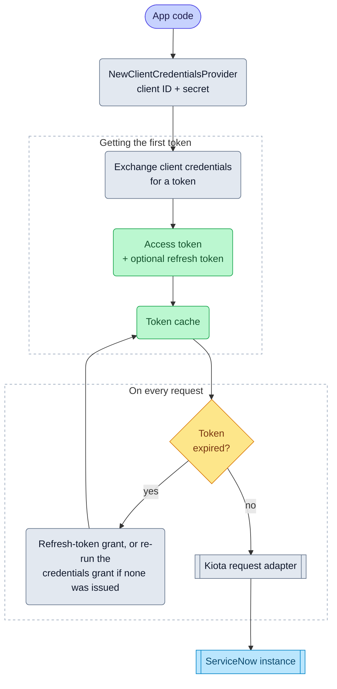

# Client credentials

import GoSnippet from '@site/src/components/GoSnippet';
import authGo from '@site/snippets/auth.go';

The Client Credentials flow works for server‑to‑server integrations where
no user participates. The SDK authenticates using a client ID and client secret,
and ServiceNow issues an access token representing the application itself.

## Objective

Configure and use the Client Credentials OAuth flow with the Service‑Now SDK
using values provided by your ServiceNow administrator.

## Required values

Your administrator must provide:

| Value           | Description                                        |
| --------------- | -------------------------------------------------- |
| Service‑Now URL | Base URL of the instance                           |
| Client ID       | From a ServiceNow OAuth application registry entry |
| Client Secret   | From the same registry entry                       |

## SDK flow

## Initialize the SDK

<GoSnippet language="go" src={authGo} region="auth_client_credentials" />
