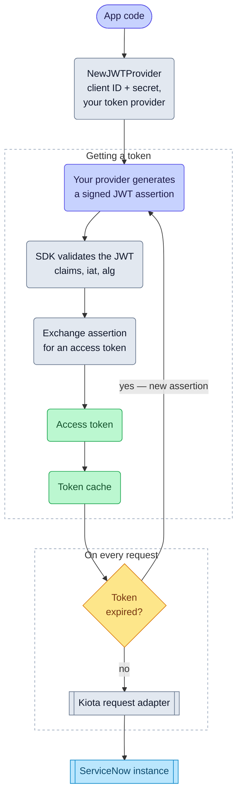

# JWT token authentication

import GoSnippet from '@site/src/components/GoSnippet';
import authGo from '@site/snippets/auth.go';

JWT Token authentication lets the SDK authenticate using a signed JSON Web
Token (JWT). ServiceNow validates the signature using a public key configured in
your instance and issues an access token. This method is ideal for secure,
non‑interactive server‑to‑server integrations.

## Objective

Configure and use JWT Token authentication with the Service‑Now SDK using values
provided by your ServiceNow administrator.

## Required values

Your administrator must provide:

| Value           | Description                                   |
| --------------- | --------------------------------------------- |
| Service‑Now URL | Base URL of the instance                      |
| Client ID       | From a ServiceNow OAuth or JWT registry entry |
| Client Secret   | Required by ServiceNow for JWT Bearer flows   |

Your application must also provide:

- **Private key** used to sign the JWT assertion
- A **token provider** capable of generating signed JWT assertions

## SDK flow

## Initialize the SDK

<GoSnippet language="go" src={authGo} region="auth_jwt" />
