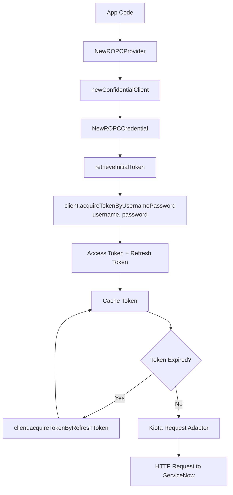

# Resource owner password credentials

The resource owner password credentials flow lets the SDK exchange a
username and password for an OAuth access token. This method is typically used
only in controlled environments or legacy integrations where interactive login
isn't possible.

## Objective

Configure and use the Resource Owner Password Credentials (ROPC) OAuth flow with the Service‑Now SDK using values
provided by your ServiceNow administrator.

## Required values

Your administrator must provide:

| Value           | Description                                        |
| --------------- | -------------------------------------------------- |
| Service‑Now URL | Base URL of the instance                           |
| Client ID       | From a ServiceNow OAuth application registry entry |
| Client Secret   | From the same registry entry                       |
| Username        | ServiceNow user account used for authentication    |
| Password        | Password for the user account                      |

## SDK flow




## Initialize the SDK

```go
import (
    "log"

    servicenowsdkgo "github.com/michaeldcanady/servicenow-sdk-go"
    "github.com/michaeldcanady/servicenow-sdk-go/credentials"
)

func main() {
    cred, err := credentials.NewROPCProvider(
        "{clientID}",
        "{clientSecret}",
        "{username}",
        "{password}",
        credentials.WithInstance("{instance}"),
    )
    if err != nil {
        log.Fatal(err)
    }

    client, err := servicenowsdkgo.NewServiceNowServiceClient(
        servicenowsdkgo.WithAuthenticationProvider(cred),
        servicenowsdkgo.WithInstance("{instance}"),
    )
    if err != nil {
        log.Fatal(err)
    }

    // Client is now authenticated and ready to use
    _ = client
}
```
