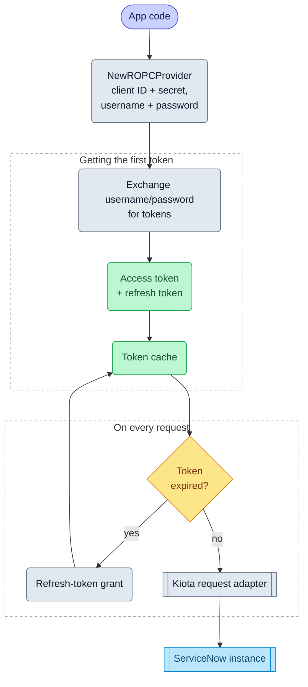

# Resource owner password credentials

import GoSnippet from '@site/src/components/GoSnippet';
import authGo from '@site/snippets/auth.go';

The resource owner password credentials flow lets the SDK exchange a
username and password for an OAuth access token. This method is typically used
only in controlled environments or legacy integrations where interactive login
isn't possible.

## Objective

Configure and use the Resource Owner Password Credentials (ROPC) OAuth flow with the Service‑Now SDK using values
provided by your ServiceNow administrator.

## Required values

Your administrator must provide:

| Value           | Description                                        |
| --------------- | -------------------------------------------------- |
| Service‑Now URL | Base URL of the instance                           |
| Client ID       | From a ServiceNow OAuth application registry entry |
| Client Secret   | From the same registry entry                       |
| Username        | ServiceNow user account used for authentication    |
| Password        | Password for the user account                      |

## SDK flow

## Initialize the SDK

<GoSnippet language="go" src={authGo} region="auth_ropc" />
